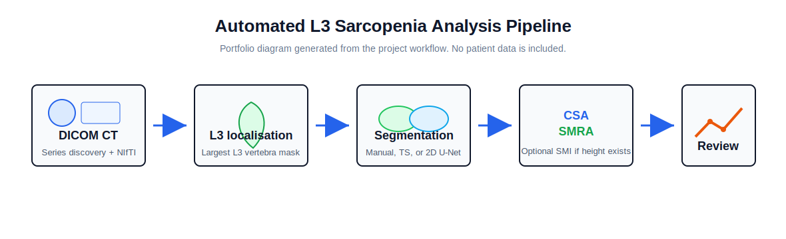
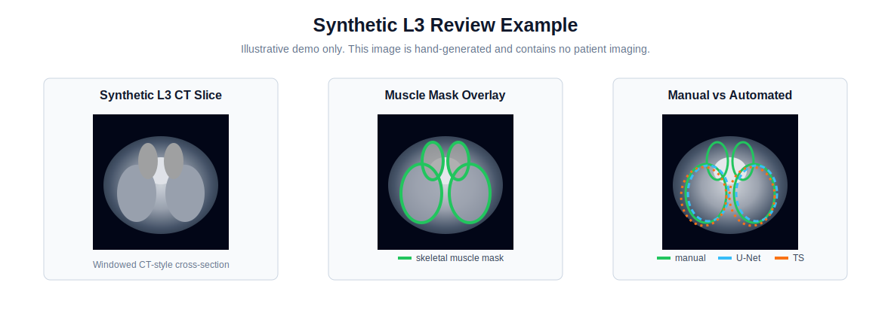
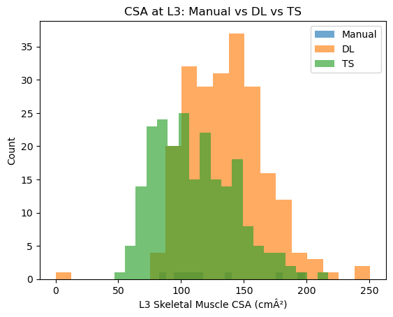

# L3 Sarcopenia CT Analysis

Research prototype for automated L3 skeletal muscle analysis from abdominal CT scans. This MSc project converts CT DICOM series into analysis-ready volumes, identifies the L3 slice, compares manual and automated muscle masks, calculates body-composition metrics, and provides a Streamlit review interface.

> Research use only. This project is not clinically validated, not regulatory approved, and must not be used for diagnosis, treatment, autonomous screening, or clinical decision-making.



## Portfolio Snapshot

**Problem.** Sarcopenia, the loss of skeletal muscle mass and function, is associated with frailty, poorer surgical outcomes, oncology prognosis, and reduced physiological reserve. L3 skeletal muscle area on CT is widely used in body-composition research, but manual analysis is slow and difficult to scale.

**Solution.** ATTDS implements an end-to-end research workflow that turns routine CT imaging into L3 skeletal muscle measurements, visual quality checks, and evaluation plots. It combines TotalSegmentator, a compact PyTorch 2D U-Net, metric calculation, and a Streamlit review app.

**My role.** Designed and implemented the full dissertation prototype: DICOM/NIfTI processing, L3 slice selection, segmentation pipeline, model training/inference scripts, CSA/SMRA/SMI calculation, evaluation plots, and the interactive review/reporting app.

## Demo Outputs

The CT-style image below is synthetic and safe for public display. Real CT data and patient-derived overlays are intentionally excluded from the repository.



The aggregate plot below is extracted from the dissertation outputs and shows the kind of evaluation reporting produced by the project. It is not a public benchmark claim unless paired with the original dataset description, split, and governance context.



Additional synthetic example outputs are available in [`docs/demo_data.md`](docs/demo_data.md) and [`examples/synthetic_metrics.csv`](examples/synthetic_metrics.csv).

## What The System Does

- Discovers and groups CT DICOM series by `SeriesInstanceUID`.
- Converts the selected CT series to NIfTI using SimpleITK.
- Runs TotalSegmentator for L3 vertebra localisation and tissue segmentation.
- Selects the L3 axial slice from the largest `vertebrae_L3` mask area.
- Exports L3 CT and mask pairs for model training.
- Trains a compact 2D U-Net for skeletal muscle segmentation.
- Predicts L3 muscle masks and compares them with manual and TotalSegmentator masks.
- Calculates cross-sectional area, skeletal muscle radiation attenuation, and optional skeletal muscle index.
- Generates Dice, distribution, scatter, Bland-Altman, CDF, and quality-note plots.
- Provides a Streamlit app for patient-level review, overlays, CSV export, and PDF reports.

## Technical Architecture

```text
DICOM CT series
  -> NIfTI conversion and metadata extraction
  -> TotalSegmentator L3 vertebra segmentation
  -> L3 slice index selection
  -> Manual / TotalSegmentator / U-Net muscle masks
  -> CSA, SMRA, optional SMI
  -> Evaluation plots, CSV outputs, Streamlit review
```

## Repository Structure

```text
.
├── app/
│   └── streamlit_app.py
├── docs/
│   ├── assets/
│   ├── data_privacy.md
│   ├── demo_data.md
│   ├── methodology.md
│   └── model_card.md
├── examples/
│   └── synthetic_metrics.csv
├── tests/
│   └── test_metrics.py
├── digitize_dicom.py
├── run_all_segmentation.py
├── train_l3_unet.py
├── predict_l3_unet.py
├── compute_all_csa_smra.py
├── make_all_plots.py
└── sarcopenia_metrics.py
```

## Installation

```bash
git clone https://github.com/Inioluwa-Ashamu/l3-sarcopenia-ct-analysis.git
cd l3-sarcopenia-ct-analysis
python -m venv .venv
source .venv/bin/activate
pip install -r requirements.txt
```

On Windows PowerShell, activate the environment with:

```powershell
.venv\Scripts\Activate.ps1
```

For GPU training or inference, install the PyTorch build that matches your CUDA version. TotalSegmentator may also need model-cache and platform-specific setup.

## Configuration

Copy `.env.example` and adapt the paths for your local data. Keep DICOM, NIfTI, model weights, and patient-derived outputs outside the Git repository.

```bash
ATTDS_RAW_ROOT=/path/to/raw_dicom
ATTDS_DATA_ROOT=/path/to/anon_dig
ATTDS_MANUAL_DIR=/path/to/manual_masks
ATTDS_TS_EXE=TotalSegmentator
```

## Pipeline Commands

```bash
python digitize_dicom.py
python run_all_segmentation.py
python write_l3_index_from_mask.py
python export_l3_pairs.py
python train_l3_unet.py
python predict_l3_unet.py
python compute_all_csa_smra.py
python eval_dice_manual.py
python eval_dice_manual_vs_TS.py
python make_all_plots.py
streamlit run app/streamlit_app.py
```

## Metrics

CSA is calculated from the positive mask area:

```text
CSA_cm2 = positive_mask_pixels * pixel_area_cm2
```

SMRA is calculated as mean CT attenuation inside the skeletal muscle mask after applying the common skeletal muscle HU window:

```text
-29 HU to 150 HU
```

SMI is optional and only calculated when height is available:

```text
SMI_cm2_m2 = CSA_cm2 / height_m^2
```

## Testing

```bash
python -m unittest discover -s tests
```

The current unit tests cover the core metric helpers: CSA, SMRA, Dice overlap, and L3 max-area slice selection.

## Privacy And Governance

This repository does not include raw CT imaging, DICOM files, NIfTI volumes, trained weights, or patient-level reports. Dissertation CT overlays remain excluded unless there is explicit permission for public redistribution of anonymised, patient-derived images.

See [`docs/data_privacy.md`](docs/data_privacy.md) for the project privacy position and [`docs/model_card.md`](docs/model_card.md) for intended-use limits.

## Limitations

- Research prototype only; not a medical device.
- No clinical validation or regulatory approval.
- No public patient imaging dataset is included.
- L3 localisation depends on TotalSegmentator vertebra output.
- The custom model segments a selected 2D L3 slice, not the full 3D volume.
- DICOM anonymisation support is limited and should not be treated as a complete de-identification workflow.
- Performance values should be reported only with dataset size, annotation protocol, evaluation split, and governance context.

## Technologies

Python, PyTorch, SimpleITK, pydicom, nibabel, NumPy, pandas, matplotlib, Streamlit, reportlab, TotalSegmentator.

## Citation

Ashamu, I. I. (2025). *Automated Tool to Detect Sarcopenia from CT Scans*. MSc Artificial Intelligence Dissertation, Manchester Metropolitan University.
